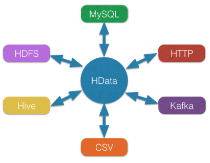
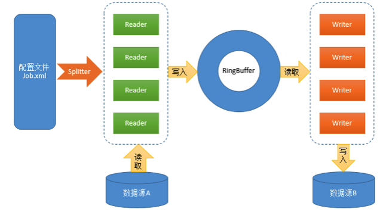

## HData

HData是一个异构的数据传输工具，致力于使用一个工具解决不同数据源（RDBMS、Hive、HDFS、HBase、MongoDB、FTP等）之间数据交换的问题。HData在设计上同时参考了开源的Sqoop、DataX，却与之有不同的实现。HData采用“框架+插件”的结构，具有较好的扩展性，框架相当于数据缓冲区，插件则为访问不同的数据源提供实现。

#### 【HData特性】

1、异构数据源之间高速数据传输；

2、跨平台独立运行；

3、数据传输过程全内存操作，不读写磁盘；

4、插件式扩展。

#### 【HData设计】

- 配置文件：XML格式，配置Reader、Writer的参数（如：并行度、数据库连接地址、账号、密码等）；

- Reader：数据读取模块，负责从数据源读取数据并写入RingBuffer；

- Splitter：根据配置文件中Reader的并行度构造相应数据的ReaderConfig对象供Reader使用，以实现数据的并行读取；

- RingBugffer：来自Disruptor的高性能环形数据缓冲区，基于事件监听模式的异步实现，采用无锁方式针对CPU缓存优化，在此用于Reader和Writer的数据交换；

- Writer：数据写入模块，负责从RingBuffer中读取数据并写入目标数据源。

HData框架通过配置读取解析、RingBugffer 缓冲区、线程池封装等技术，统一处理了数据传输中的基本问题，并提供Reader、Splitter、Writer插件接口，基于此可以方便地开发出各种插件，以满足各种数据源访问的需求。